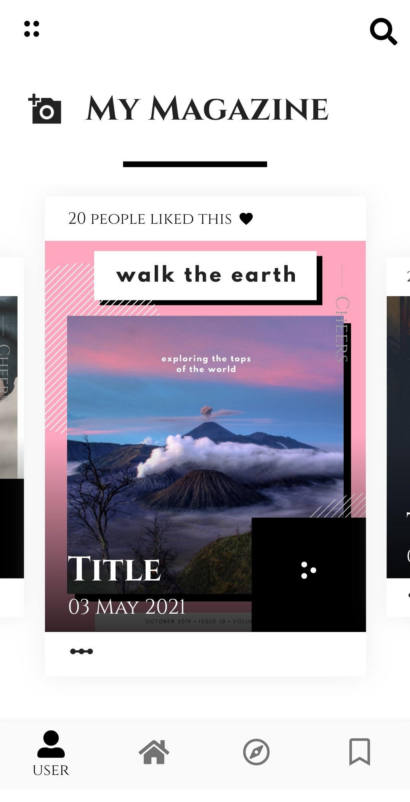
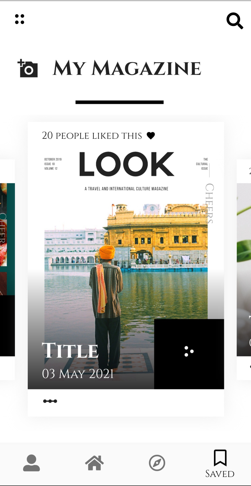
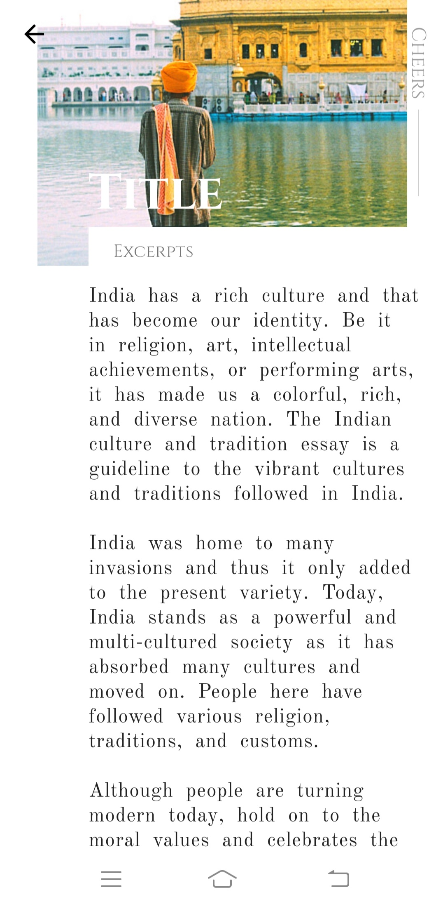

# My Magazine

The idea here is to show the concept of a mobile app for magazine using Flutter Framework. You can run through the articles and know about latest trends.

<!-- # Snapshots

 -->

## Video Preview

## Screenshots

  | 1                                                            | 2                                                            | 3                                                      | 4                                                        |
| -------------------------------------------------------------- | ----------------------------------------------------------------------- | -------------------------------------------------------------------- | ---------------------------------------------------------------------|
|  |  |  |  |

